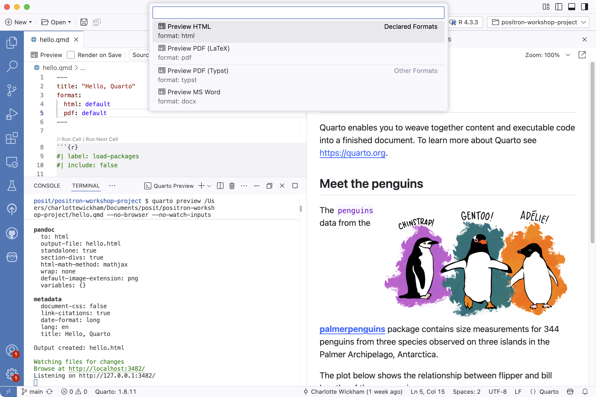
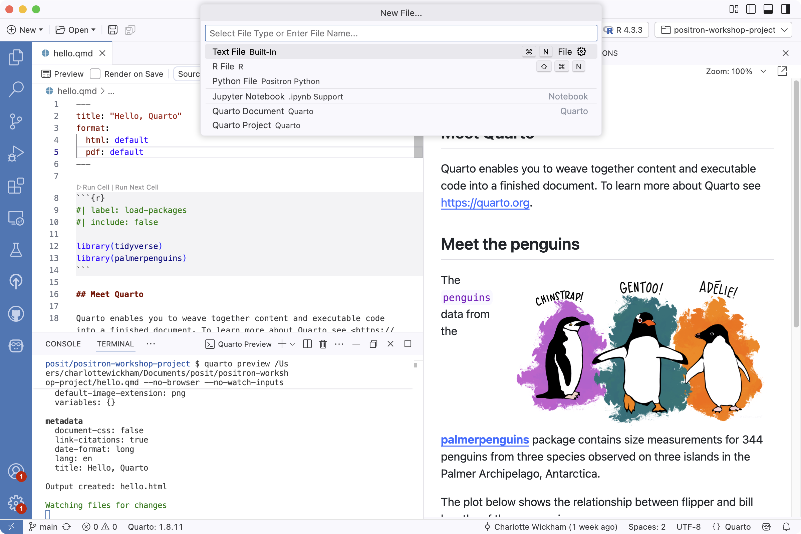
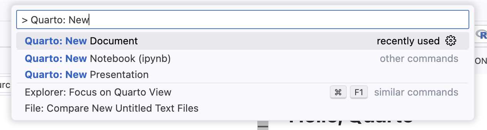
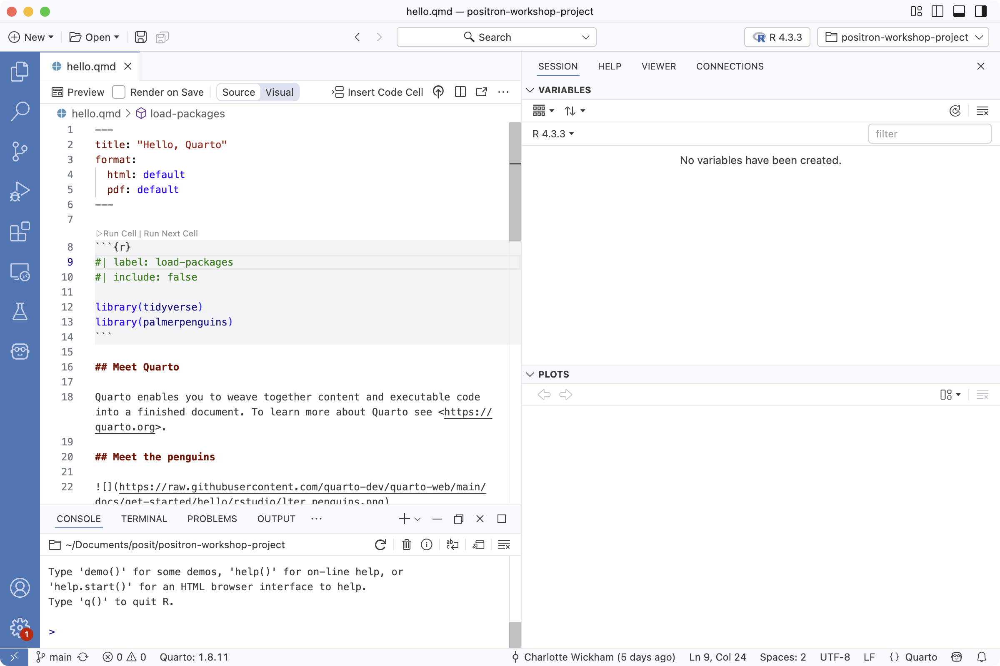
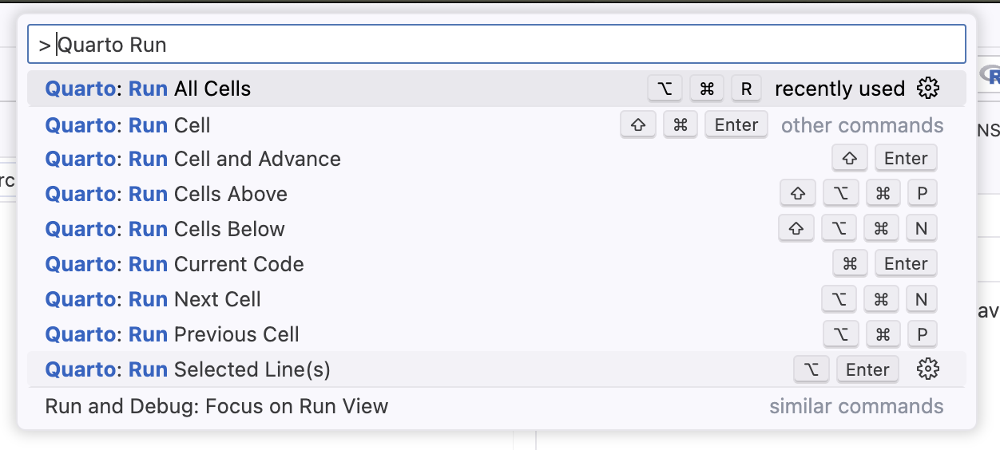
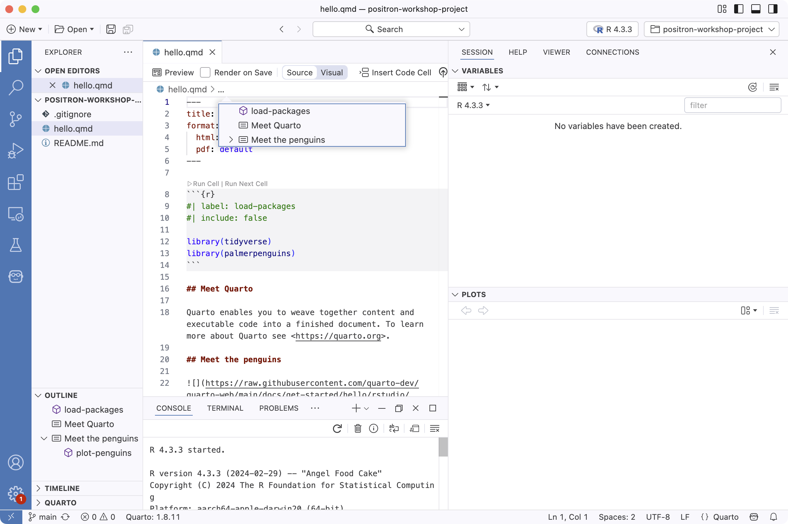
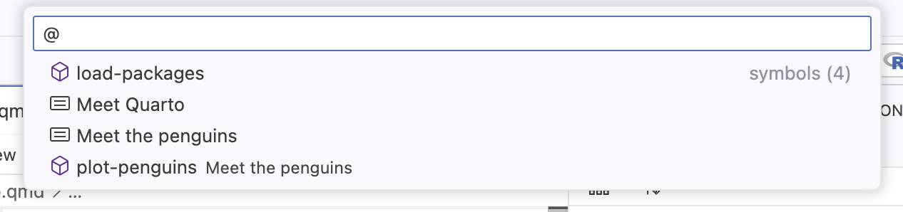
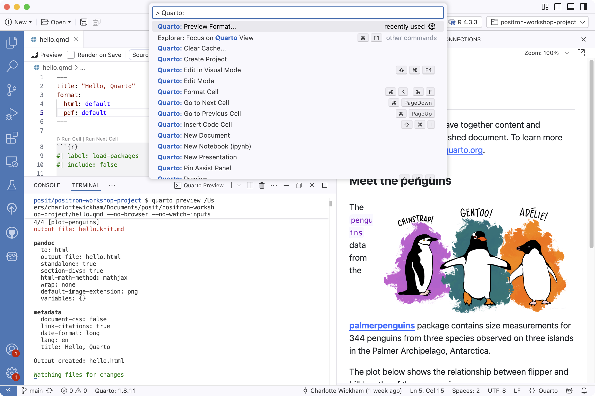
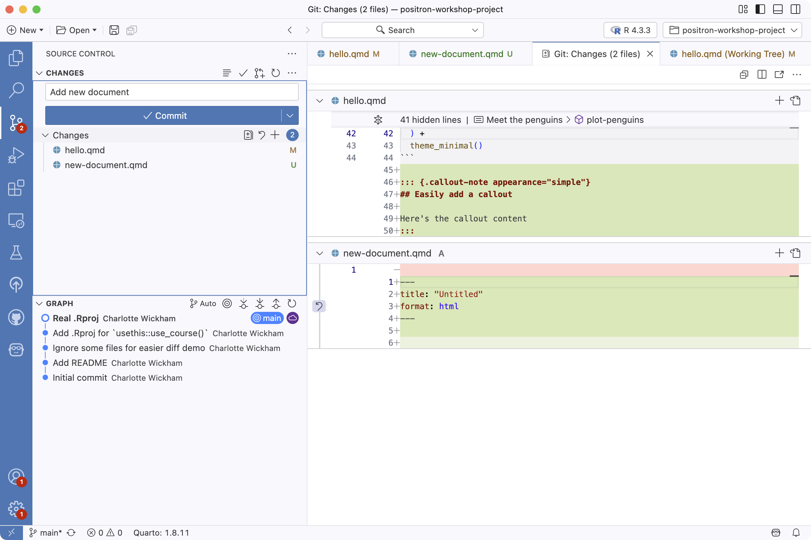
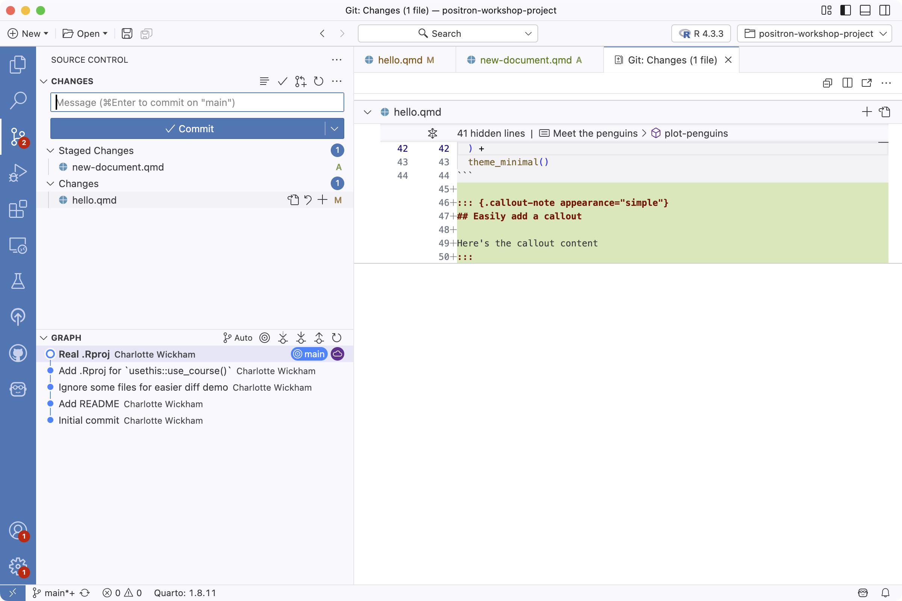

# Quarto + Positron

## Positron is Quarto-ready out of the box

::: {.columns}

::: {.column}

**Bundled Quarto CLI**

(or one it finds on your path)

= what you need to run `quarto` commands in the Terminal

:::

::: {.column}

**Quarto extension**

= provides the `Quarto: ...` commands and UI support

:::

:::

::: notes
No separate install is required to get started: Positron bundles the Quarto
CLI and ships the Quarto VS Code extension pre-installed.

The Quarto version in use is shown in the status bar at the bottom of the
window.
:::

::: footer
Learn more: <https://quarto.org/docs/tools/positron.html>
:::

# Basic workflow

## Demo: basic workflow

1. Open `hello.qmd`

2. Click **Preview** (aka the Render button in RStudio)

3. Quarto commands are run in the **Terminal** pane

4. Rendered output opens in the **Viewer** pane

::: notes
Demo this live, then show the annotated screenshots on the next slides.

We'll have lots of screenshots throughout — they're there so the steps are
easy to retrace later.
:::

## The Preview button

::: {.columns}

::: {.column width="65%"}

{.screenshot fig-alt="Positron with hello.qmd open in the editor, the Preview button in the editor toolbar, quarto preview running in the Terminal pane, and the rendered document in the Viewer pane."}

:::

::: {.column width="35%"}

::: {.incremental}

- **Preview** button in the editor toolbar

- Quarto version in the status bar

- Runs `quarto preview` in the Terminal

- Opens the rendered document in the Viewer

:::

:::

:::

## Preview a specific format

::: {.columns}

::: {.column width="65%"}

{.screenshot fig-alt="The Preview button dropdown listing declared formats, Preview HTML and Preview PDF (LaTeX), and other formats, Preview PDF (Typst) and Preview MS Word."}

:::

::: {.column width="35%"}

- The Preview dropdown lists the formats declared in the document

- Command: `Quarto: Preview Format...`

:::

:::

## Render on Save {.smaller}

By default, saving does **not** re-render — renders can be slow.

Three ways to turn it on:

::: {.incremental}

1. The **Render on Save** checkbox in the editor toolbar:

   {.screenshot fig-alt="The editor toolbar of hello.qmd showing the Preview button, the Render on Save checkbox, and the Source and Visual toggle."}

2. The Positron setting: search `quarto.render` in Settings

3. Per document or project, in YAML — supersedes the Positron setting:

   ```{.yaml filename="hello.qmd"}
   editor:
     render-on-save: true
   ```

:::

::: notes
The default is off for a reason: a render may include long-running
computations, and you want to be able to save freely without paying for one.

The YAML option travels with the document or project — another setting that
can live in version control, like the Air setup.

Hold that thought about long-running computations — it's exactly the problem
freeze solves, later in the workshop.
:::

## Start a new document

::: {.columns}

::: {.column width="60%"}

{.screenshot fig-alt="The New File dialog in Positron with file type options including Quarto Document and Quarto Project."}

:::

::: {.column width="40%"}

**File > New File...** then **Quarto Document**

or the command palette:

{.screenshot fig-alt="The command palette filtered to Quarto: New, showing Quarto: New Document, New Notebook, and New Presentation."}

:::

:::

# Document workflow

## Demo: document workflow {.smaller}

- **Code cells**: Run selection: `cmd/ctrl + enter`, run cell: `shift + cmd/ctrl + enter`, commands: `Quarto: Run ...`

- **Navigation**: Breadcrumbs, Outline pane, Go to Symbol in Editor

- **Visual mode**: Insert Anything with `/`

::: notes
Demo each live, then walk through the screenshots.

Visual mode caveat: it's a great fit for rich-text authoring, but support in
Positron is limited — statement execution and other language features don't
work there. Tell attendees to switch back to Source mode to run code, and
point anyone who cares to
<https://github.com/posit-dev/positron/issues/1805> for updates.
:::

## Code cells

::: {.columns}

::: {.column width="60%"}

{.screenshot fig-alt="A Quarto document in the Positron editor with Run Cell and Run Next Cell actions above a code cell."}

:::

::: {.column width="40%"}

- **Run Cell | Run Next Cell** actions above each cell

- Run selection: `cmd/ctrl + enter`

- Run cell: `shift + cmd/ctrl + enter`

- Optional: [inline output](https://positron.posit.co/quarto-inline-output.html) in the editor

:::

:::

## Code cells, from the command palette

{.screenshot fig-alt="The command palette filtered to Quarto Run, showing Quarto: Run All Cells, Run Cell, Run Cell and Advance, Run Cells Above, Run Cells Below, Run Current Code, Run Next Cell, Run Previous Cell, and Run Selected Lines, with their keyboard shortcuts."}

## Insert a code cell

::: {.columns}

::: {.column width="55%"}

{.screenshot fig-alt="A new untitled Quarto document with the Insert Code Cell button in the editor toolbar."}

:::

::: {.column width="45%"}

- **Insert Code Cell** in the editor toolbar

- Shortcut: `shift + cmd/ctrl + I`

- Command: `Quarto: Insert Code Cell`

:::

:::

## Navigation

::: {.columns}

::: {.column width="65%"}

{.screenshot fig-alt="Positron with the breadcrumbs dropdown showing the document sections and the Outline pane listing load-packages, Meet Quarto, Meet the penguins, and plot-penguins."}

:::

::: {.column width="35%"}

- **Breadcrumbs** at the top of the editor

- **Outline** pane in the sidebar

- Command: **Go to Symbol in Editor** (`@`)

:::

:::

## Go to Symbol in Editor

{.screenshot fig-alt="The Go to Symbol in Editor quick pick listing the symbols in the document: load-packages, Meet Quarto, Meet the penguins, and plot-penguins."}

## Editing assistance

::: {.columns}

::: {.column}

**YAML intelligence**

Completion for YAML options, red squiggles for invalid ones on save

**Help pane**

Hover for tooltips, `F1` opens full help for the function under the cursor

:::

::: {.column}

**Live preview**

LaTeX math and Mermaid/Graphviz diagrams preview as you type (`cmd/ctrl + shift + L`)

**Snippets**

`Insert Snippet` for boilerplate: code blocks, callouts, divs

:::

:::

::: notes
All four come from the Quarto extension — nothing to install or configure.

YAML completion works in the front matter, in `_quarto.yml`, and in cell
options; the diagnostics fire when the document is saved.

Also worth a mention: `Quarto: Show Assist Panel` opens a sidebar panel that
shows an image thumbnail when the cursor is on an image path, and a live
equation preview when editing LaTeX math.
:::

## Settings worth stealing {.smaller}

```{.json filename="settings.json"}
{
  "[quarto]": {
    "editor.wordWrap": "off",
    "editor.language.brackets": [[":::", ":::"]],
    "editor.language.colorizedBracketPairs": [[":::", ":::"]]
  },
  "editor.rulers": [80, { "color": "#b22222", "column": 120 }],
  "files.watcherExclude": { "**/.quarto/**": true },
  "search.exclude": { "*/.quarto": true }
}
```

::: {.incremental}

- **Word wrap off** — with one sentence per line, Git diffs show the sentence that changed, not the whole paragraph

- **Rulers at 80 and 120** — a backstop for runaway lines (long URLs, table rows); prose breaks at sentences, not characters

- **`:::` as a bracket pair** — fold and color-match fenced divs

- **Exclude `.quarto/`** from search and file watching — faster in big projects (also consider `_freeze`)

:::

::: footer
Adapted from: [Mickaël Canouil, *Optimising VS Code and Positron for Quarto*](https://mickael.canouil.fr/posts/2025-11-20-quarto-editor-settings/) (CC BY-NC-SA)
:::

::: notes
These are opinionated settings — encourage attendees to try them and adjust.

Word wrap off also keeps pipe tables from wrapping mid-cell.

Break prose at sentence boundaries, not at a character count — that is what
makes the Git diffs sentence-level. The rulers are only a backstop: 80 is a
subtle vertical line, a soft guide; 120 is firebrick red (`#b22222`), flagging
a runaway line — usually a long URL, a pipe-table row, or code — not a place
to break a sentence.

The settings can live in user settings (everywhere) or in a project's
`.vscode/settings.json` — same pattern as the Air setup, so it can be checked
into version control and shared.
:::

## Render commands

::: {.columns}

::: {.column width="60%"}

{.screenshot fig-alt="The command palette filtered to Quarto:, showing commands including Preview Format, Clear Preview, Create Project, Edit in Visual Mode, Format Cell, Go to Next Cell, Insert Code Cell, New Document, and New Presentation."}

:::

::: {.column width="40%"}

- `Quarto: Render Document` renders all declared formats

- `Quarto: Render Project` renders all files in the project

:::

:::

::: notes
Live demo a command someone in the room suggests.
:::

# Coming from RStudio

## What's different?

::: {.incremental}

- No push-button publishing, except to Posit Connect via the [Publisher extension](https://open-vsx.org/)

- R Markdown (`.Rmd`) files preview with Quarto

- Command palette: `R: Render Document With R Markdown` to render with {rmarkdown} instead

:::

::: footer
Learn more: <https://positron.posit.co/quarto.html>
:::

## Updating Quarto {.smaller}

::: {.columns}

::: {.column}

**Strategy 1: Rely entirely on Positron's bundled Quarto**

- Get updates as Positron is updated (with auto-update on)

- Currently, no easy way to use this version outside of Positron

:::

::: {.column}

**Strategy 2: Manage Quarto manually from [quarto.org](https://quarto.org/docs/download/)**

- Positron will prefer this install, even if it's older

- You can specify a path with the `quarto.path` setting

:::

:::

::: footer
Download: <https://quarto.org/docs/download/>
:::

# Git

## Demo: Git

- **Changes** pane

- Open a change: the diff opens in an editor — closest to RStudio's diff

- Add, commit

- **Graph**: pull/push, like RStudio's History view

- Current branch

::: notes
Demo this live, then walk through the screenshots.
:::

## Examine changes

::: {.columns}

::: {.column width="65%"}

{.screenshot fig-alt="The Source Control pane in Positron listing changed files, with a commit message box and Commit button, the commit Graph below, and diff editors open for hello.qmd and new-document.qmd."}

:::

::: {.column width="35%"}

- Changes live in the **Source Control** pane

- Click a file and the diff opens in an editor

- Message + **Commit**

- **Graph**: commit history

:::

:::

::: notes
Point out where changes live and what they look like: files, repo, branches,
etc. The buttons give a basic set of actions, the menus more, and then the
command line.
:::

## Git workflow

::: {.columns}

::: {.column width="65%"}

{.screenshot fig-alt="The Source Control pane with staged and unstaged changes, the commit message box, and the commit Graph showing the current branch main."}

:::

::: {.column width="35%"}

- **Current branch**: click to switch, create new...

- **Stage and commit**

- **Pull / Push**

:::

:::

::: notes
Point out where changes live and what they look like: files, repo, branches,
etc. The buttons give a basic set of actions, the menus more, and then the
command line.
:::

# Formatting with Air

## Demo: formatting with Air

1. Open `hello.qmd` and mangle an R cell — odd spacing, one long pipe chain

2. Fix it once: `Quarto: Format Cell`

3. Turn on format on save: `Air: Initialize Workspace Folder`

4. Mangle the cell again, save, watch it snap back

::: notes
Demo this live, then the next slides explain what just happened.

Point out that Air only touches R code cells — prose and YAML are left
alone. The format-on-save setup lands in `.vscode/settings.json`; the last
slide of this section shows exactly what was written.
:::

## Air: an R code formatter

::: {.incremental}

- An extremely fast R code formatter, from Posit

- Ships with Positron — nothing to install, nothing to update

- Formats R code in `.R` files, and R cells in `.qmd` files when the Quarto extension is active

:::

::: footer
Learn more: <https://www.tidyverse.org/blog/2025/02/air/>
:::

::: notes
Same idea as `usethis::use_tidy_style()`, but automatic and instantaneous.

Air formats R code only — Python cells are not touched.
:::

## Air in a Quarto document

::: {.columns}

::: {.column}

**Format once:**

- Command: `Quarto: Format Cell`

- Shortcut: `cmd/ctrl + K`, then `cmd/ctrl + F`

:::

::: {.column}

**Format on save:**

- Command: `Air: Initialize Workspace Folder`

- Writes `.vscode/settings.json` and `air.toml` — check them in, and the whole team gets the same setup

:::

:::

::: notes
The workspace settings land in version control — a nice callback to the Git
section: formatting stops being a per-person preference and becomes a project
property.
:::

## What format on save looks like

```{.json filename=".vscode/settings.json"}
{
  "[r]": {
    "editor.formatOnSave": true,
    "editor.defaultFormatter": "Posit.air-vscode"
  },
  "[quarto]": {
    "editor.formatOnSave": true,
    "editor.defaultFormatter": "quarto.quarto"
  }
}
```

::: notes
This is what `Air: Initialize Workspace Folder` writes for you. The `[quarto]`
block is the piece that makes it apply to R cells in `.qmd` files.

Nobody needs to memorize this — the point is that it exists and is one
command away.
:::

# LLM assistance

## Demo: Posit Assistant

1. Open the Posit Assistant pane in the sidebar

2. Ask it to explain the `plot-penguins` cell in `hello.qmd` — it can see the open document and the session

3. Ask it to write alt text for the penguins plot, then paste the result into `fig-alt`

4. Read it, check it's accurate, *then* keep it

::: notes
Demo this live. Step 2 is the moment to point out session awareness: it
describes the data frame you actually have loaded, not one you described.

Step 4 is the deliberate part — model the review habit out loud before
moving on.
:::

## Posit Assistant

AI assistance built into Positron, aware of your R/Python session:

::: {.incremental}

- **Chat** in the sidebar — sees your console, variables, and files

- **Inline completions** and Next Edit Suggestions as you type

- Slash commands for structured tasks: `/plan`, `/clean`, `/report`

:::

::: footer
Learn more: <https://assistant.posit.co/docs/>
:::

::: notes
Pre-installed in recent versions of Positron.

Session awareness is the differentiator from a generic chatbot: it can see
the data frame you actually have loaded, not the one you describe.
:::

## Practical, deliberate uses in a Quarto workflow {.smaller}

::: {.columns}

::: {.column}

**Good fits:**

- Draft and revise prose; tighten wording

- Write alt text for figures

- Explain or debug a code cell; interpret an error message

- Fix YAML indentation and option typos

:::

::: {.column}

**Your job, not its job:**

- Review every word before it ships

- Run every line of code it writes

- Check every factual claim

- Keep secrets and credentials out of prompts

:::

:::

::: notes
"Deliberate" is the operative word: decide what to delegate. A useful rule of
thumb — delegate the tedious (formatting, alt text, boilerplate), keep the
judgment calls (what the analysis means, whether the code is right).

The figure alt-text suggestion is a quiet superpower: it makes accessibility
cheap enough to actually happen.
:::

# Wrap-up

## Learn more

- [Quarto docs: Guide > Tools > Positron](https://quarto.org/docs/tools/positron.html)
  — the Positron-specific Quarto features

- [Positron docs: Quarto](https://positron.posit.co/quarto.html)
  — `quarto.path`, rendering `.Rmd` files with {rmarkdown}

- [VS Code docs: Source Control](https://code.visualstudio.com/docs/sourcecontrol/overview)
  — the Git pane Positron inherits

- [Formatting R code with Air](https://positron.posit.co/guide-r-air.html)
  — setup, format on save, `air.toml`

- [Posit Assistant docs](https://assistant.posit.co/docs/)
  — chat, completions, slash commands

# Questions?
