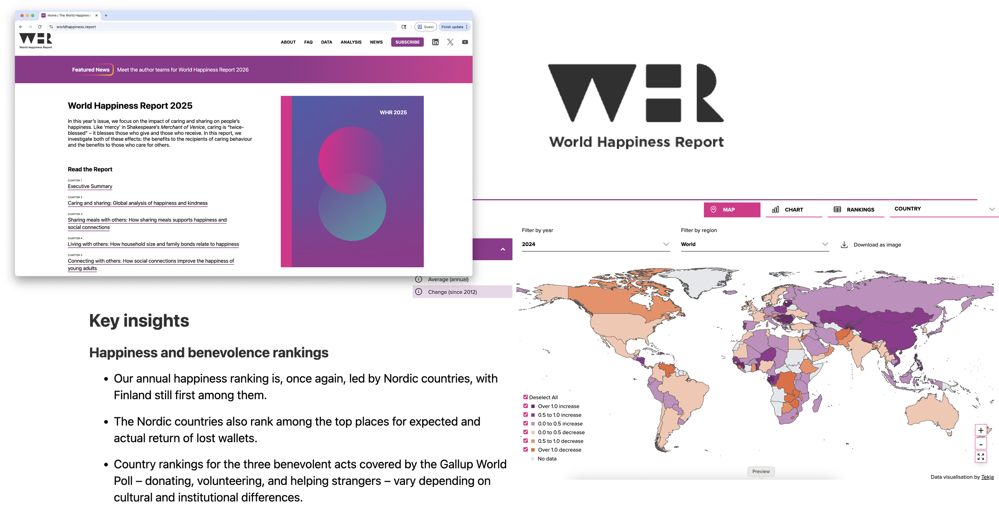
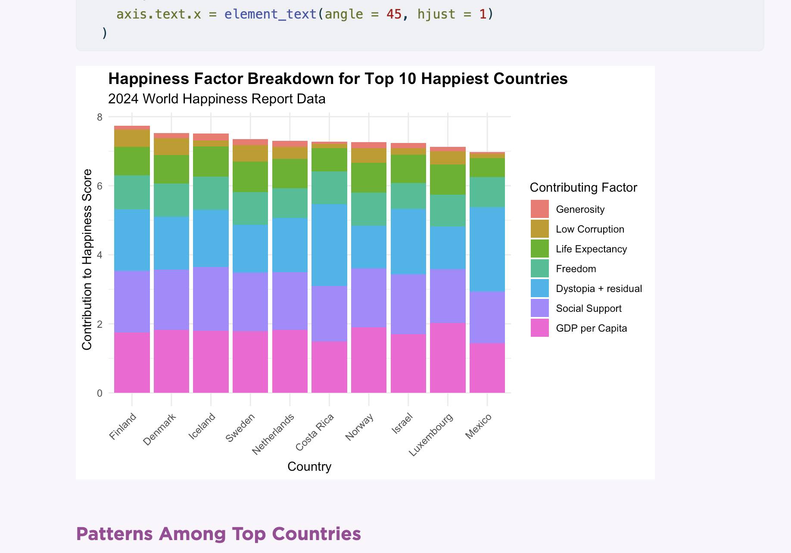

# One look, every output

## A theme gets you started {.smaller}

Quarto ships 25 [Bootswatch](https://bootswatch.com/) themes:

::: {.columns}
::: {.column width="33%"}
default, cerulean, cosmo, cyborg, darkly, flatly, journal, litera, lumen
:::
::: {.column width="33%"}
lux, materia, minty, morph, pulse, quartz, sandstone, simplex, sketchy
:::
::: {.column width="33%"}
slate, solar, spacelab, superhero, united, vapor, yeti, zephyr
:::
:::

```{.yaml filename="report.qmd"}
format:
  html:
    theme: flatly
```

::: notes
One key, a whole look. Free, and nobody's brand.

`theme:` is `format: html` only — the first hint of the problem this module is
about.
:::

## But you don't want *a* theme, you want *your* theme

{.screenshot fig-alt="Four branded outputs from the World Happiness Report overlapping each other: the organisation's website in a browser window, its wordmark logo, a slide reading Key insights, and an interactive world map coloured by change in happiness score. All four carry the same purple and pink palette and the same typeface."}

::: notes
TO DO: may need to update image

Same palette, same type, same logo — a website, a logo, a deck, a dashboard.

Ask: how many places would you have to set that today? A theme per format,
per project.
:::

## The same look, in how many places? {.smaller}

::: {.incremental}
- `theme:` — one SCSS file for `html`, another for `revealjs`
- `include-in-header:` — fonts, again
- `mainfont:`, `colorlinks:` — `pdf` has its own names
- your plots — `theme_*()` in R, `theme()` in Python
- and again in the next project
:::

::: {.fragment}
Five descriptions of one brand, each drifting on its own schedule.
:::

::: notes
The problem is not that any one of these is hard. It's that there is no single
place where the brand is written down.

This is the same shape as module 03 and 04: say it once, in the right place.
:::

# `_brand.yml`

##

{fig-align="center" width="50%" fig-alt="The brand.yml logo: a paintbrush inside a circle with a purple to orange gradient, next to the words BRAND YML."}

[Unified branding with a simple YAML file]{style="font-size: 1.2em;"}

::: {.fragment}
<br>

One file, written once, applied across Quarto formats — and beyond Quarto.
:::

::: footer
Learn more: <https://posit-dev.github.io/brand-yml/>
:::

::: notes
TO DO: may need to update image

A specification, not a Quarto feature. Quarto, Shiny, bslib and the plotting
libraries all read the same file.
:::

## Two steps

::: {.fragment}
[1. Describe the brand in one `_brand.yml`.]{style="font-size: 1.5em;"}

[2. Quarto applies it to almost every format.]{style="font-size: 1.5em;"}
:::

<br>

::: {.fragment}
No format-specific theming to write. No SCSS unless you want it.
:::

::: notes
Step 2 is the part that is hard to believe until you render it twice.

"Almost" — the exceptions are worth knowing, and we get to them.
:::

## Who reads `_brand.yml`? {.smaller}

::: {style="--mermaid-max-height: 500px"}
```{mermaid}
flowchart LR
    by{brand.yml}
    by-->quarto[Quarto]
    quarto-->quarto-html[html]
    quarto-->quarto-typst[typst]
    quarto-html-->quarto-websites[Websites]
    quarto-html-->quarto-presentations[Presentations]
    quarto-html-->quarto-dashboards[Dashboards]
    quarto-html-->quarto-emails[Emails]

    by-->R
    R-->r-bslib["{bslib}"]
    r-bslib-->r-thematic["{thematic}"]
    r-bslib-->r-shiny["Shiny for R"]
    r-bslib-->r-pkgdown["pkgdown"]

    by-->Python
    Python-->py-brand_yml["brand_yml"]
    py-brand_yml-->py-shiny[Shiny for Python]
    py-brand_yml-->py-plots[seaborn, matplotlib, ...]
```
:::

<style>
.mermaid-js {
  max-height: var(--mermaid-max-height);
}
.mermaid-js .nodeLabel {
  color: var(--bs-black) !important;
  font-weight: 500;
}
</style>

::: footer
Learn more: <https://posit-dev.github.io/brand-yml/>
:::

::: notes
Note `pdf` is not on this branch — `typst` is. That is module 04's argument,
arriving early.

The same file themes a Shiny app and a pkgdown site. One brand, one repo,
several tools.
:::

## Five keys

::: {.incremental}
* `meta` — who the brand belongs to: name, links
* `logo` — the image files, at a few sizes
* `color` — the palette, and the roles colors play
* `typography` — fonts for base, headings, links, code
* `defaults` — per-tool escape hatches
:::

::: notes
`color` and `typography` do most of the work. `defaults` is where you put the
thing brand.yml has no word for.

Nothing here mentions a format. That is the whole idea.
:::

## `_brand.yml` {.smaller}

```{.yaml code-line-numbers="1-4|6-11|13-24|26-42" filename="_brand.yml"}
meta:
  name: Bureau of Regional Statistics
  link:
    home: https://example.gov/brs

logo:
  images:
    mark:
      path: brs-logo.svg
      alt: Bureau of Regional Statistics logo featuring a simple bar chart
  small: mark

color:
  palette:
    forest: "#1b5e4f"
    ink: "#1f2933"
    slate: "#52606d"
    sand: "#f5f2ea"

  background: white
  foreground: ink
  primary: forest
  secondary: slate
  tertiary: sand

typography:
  fonts:
    - family: Atkinson Hyperlegible
      source: google
      weight: [400, 600]

  base:
    family: Atkinson Hyperlegible
    weight: 400

  headings:
    family: Atkinson Hyperlegible
    weight: 600

  link:
    color: primary
    decoration: underline
```

::: notes
The Bureau of Regional Statistics — the same agency whose quarterly release we
rebuild in modules 03 and 04.

Two halves to `color`: **name** your colors in `palette`, then say what
**role** each one plays. `primary: forest`, not `primary: "#1b5e4f"`.

Roles are what formats consume. Rename the palette and nothing downstream
breaks.

Paths in a brand file resolve relative to **the brand file**, not the document.

`meta` is documentation for humans — Quarto does nothing with it yet.
:::

## Naming, then roles

```{.yaml filename="_brand.yml"}
color:
  palette:
    forest: "#1b5e4f"   # a name for a hex code
  primary: forest       # a job for a name
```

::: incremental

- In your SCSS these arrive as `$brand-forest` and `$primary`.

- In Typst, as `brand-color.primary`.

:::

::: notes
This is the callback in both remaining modules — module 03's `custom.scss`
reaches for `$primary` and `$brand-forest`, module 04's raw block for
`brand-color.primary`.

Neither one hard-codes `#1b5e4f`. That is the payoff for writing the roles
down.

The semantic list is longer than these two: `secondary`, `tertiary`,
`success`, `info`, `warning`, `danger`, `light`, `dark`. In `html` and
`dashboard` they land on the Bootstrap variables of the same name.
:::

## `defaults`: the escape hatch

::: {.columns}

::: {.column}

For the thing `brand.yml` has no word for:

::: small

```{.yaml filename="_brand.yml"}
defaults:
  bootstrap:
    defaults:
      link-decoration: underline
      navbar-fg: "#fff"
    rules: |
      h2 {
        border: none;
      }
```

:::

:::

::: {.column}

::: incremental

- `html` and `dashboard` only

- Also takes `uses`, `functions`, `mixins`

:::

:::

:::

::: notes
These are SCSS variables and rules, merged into the right layer of Quarto's
SCSS system.

This deck uses it: the `h2` border rule is in *our* `_brand.yml`.

Reach for it last. Anything you can say in `color` or `typography` reaches all
four formats; this reaches two.
:::

## Applying it

::: {.incremental}
1. Save `_brand.yml` in the root of your project.
2. Render.
:::

::: {.fragment}
Quarto finds it, and applies it to every document in the project that supports
it.
:::

. . .

<br>

::: {.columns .small}

::: {.column}

**When it isn't at the root:** Use `brand` in a document or in `_quarto.yml`:

```{.yaml code-line-numbers="3" filename="report.qmd"}
title: Regional Employment Indicators
format: html
brand: ../brand/brs.yml
```

:::

::: {.column .fragment}

**When you want to turn it off:** Use `brand: false`:

```{.yaml code-line-numbers="3" filename="report.qmd"}
title: Regional Employment Indicators
format: html
brand: false
```

:::

:::


::: notes

No key in the YAML. No line in `_quarto.yml`. The file's location *is* the
configuration.

Also works for a single document with no project around it — same directory is
enough.

`brand:` takes a path — which means a brand can live outside the project. Hold
that thought; the last section is about exactly this.

It also takes brand elements inline. Careful: doing that **replaces** the whole
of `_brand.yml`, it does not merge with it.

`false` is the door out: one document that must not carry the brand.
:::

## Using brand values in your document

Use the `brand` shortcode, `{}` anywhere a value goes — a div attribute, a background color, inline text:

<br>

```{.markdown filename="slides.qmd"}
## Findings {background-color="{}"}
```

::: footer
Learn more: <https://quarto.org/docs/authoring/brand.html#using-brand-values>
:::

::: notes
A shortcode, like `{}` in module 04 — resolved by Quarto, in the
body, before Pandoc.

`{}` does the same for images.

Colors and logos only. `typography`, `meta` and `defaults` are not reachable
this way.

Reach for it when Quarto hasn't already wired the brand into the thing you're
styling.
:::

## Your turn 1: write a brand by hand {.smaller}

::: your-turn

1. Render `report.qmd` first, so you have something to compare against.

2. Create `_brand.yml` in the same folder and name the agency's colors:

   ```yaml
   color:
     palette:
       forest: "#1B5E4F"
   ```

3. Render. Nothing changed. Now give the colors jobs:

   ```yaml
     foreground: ink
     primary: forest
   ```

4. Render. Then add `typography` with Atkinson Hyperlegible and render again.

:::

::: exercise-folder
[Exercise](https://github.com/posit-conf-2026/practical-quarto-exercises): `02-brand/01-first-brand`
:::



::: notes
The full palette and the typography block are in the README — nobody has to
type from this slide.

Step 3 is the beat: naming a color does nothing, assigning it does. Steer them
to the body text and the link to the methodology notes.

No `_quarto.yml`, no `theme:`, no `css:`. They never named the file in
`report.qmd` and Quarto found it anyway.
:::

# Light and dark

## Two appearances, one document

Give `theme` a pair, and Quarto builds both:

```{.yaml filename="_quarto.yml"}
format:
  html:
    theme:
      light: flatly
      dark: darkly
```

::: {.incremental}
- a toggle appears, top right
- the one listed **first** is the default
- `respect-user-color-scheme: true` defers to the reader's OS or browser
:::

::: notes
This is the pre-brand version, and worth showing because the shape repeats:
everything about light and dark is "give it two of something".

Order matters. `light` first means light by default.

`respect-user-color-scheme` needs JavaScript; without it readers get the first
one.
:::

## One brand, two modes 

::: {.columns}

::: {.column}

- Any color in `color` or `typography` takes a `light`/`dark` pair

- Colors in `palette` **cannot** take a pair — name the color once, choose per mode where the role is assigned

:::

::: {.column}

```{.yaml filename="_brand.yml"}
color:
  background:
    light: white
    dark: ink
  foreground:
    light: ink
    dark: sand

typography:
  headings:
    color:
      light: forest
      dark: sand
```

:::

:::

::: notes
One file, both modes. This is the cheapest version and it covers most brands.

The limitation is the reason the palette/roles split matters: `forest` is one
hex code in both modes, but which *role* it plays can differ.
:::

## Two brands, two modes

When the modes differ by more than color, split the files and define use `brand` field in either the YAML of your document or in `_quarto.yml`:

```{.yaml filename="report.qmd"}
brand:
  light: brs-light.yml
  dark: brs-dark.yml
```

::: notes
Same shape as `theme`, one level up.

Reach for this when typography or logos differ, not just colors.

In `_quarto.yml` this has to be **file paths** — inline brand metadata there is
not supported yet.
:::

## Logos for both modes {.smaller}

::: {.columns}

::: {.column width="52%"}

For the project:

```{.yaml filename="_brand.yml"}
logo:
  images:
    mark:
      path: brs-logo.svg
      alt: Bureau of Regional Statistics
    mark-reversed:
      path: brs-logo-white.svg
      alt: Bureau of Regional Statistics
  medium:
    light: mark
    dark: mark-reversed
```
:::

::: {.column width="48%"}

Override for one document:

```{.yaml filename="report.qmd"}
logo:
  light:
    path: large
    alt: Bureau of Regional Statistics
  dark: brs-logo-white.svg
```

:::

:::

::: notes
A dark logo is not a recolored light logo — that is why this is a separate
file, not a filter.

`images` is where alt text lives. Name the image once, then use the name in
`small`, `medium`, `large`.

Document-level `logo:` can name a brand resource (`large`), a file, or a pair.
:::

## Formats that can't toggle

Revealjs and Typst produce one appearance and offer no toggle between light/dark:
 
::: {.columns}

::: {.column}

```{.yaml filename="slides.qmd"}
format:
  revealjs:
    brand-mode: dark
```

:::

::: {.column}

```{.yaml filename="report.qmd"}
format:
  typst:
    brand-mode: dark
```

:::

:::

::: notes
There is no runtime in a PDF and no toggle in a deck, so the choice moves to
the YAML.

Worth saying out loud: a dark deck for a dark room is a real use case, and this
is the one key that does it.

Both formats default to light, whatever order your brand lists.
:::

## Content for one mode only {.smaller}

Use `light-content` and `.dark-content` divs -- they place the content in the same place, same size, so the layout doesn't jump when the reader toggles.


```{.markdown filename="report.qmd"}

::: {.light-content}

:::

::: {.dark-content}

:::

```

::: {.fragment}
`{}` already does this for you: it emits both, classed.
:::

::: notes
Under the hood: `body` carries `.quarto-light` or `.quarto-dark`, and CSS hides
the other one.

The default variant for `brand logo` is `both`. Ask for `light` or `dark`
explicitly and you get one, unclassed.

`{}` is the same idea for colors — the third
argument is the variant.
:::

## Your turn 2: one brand, two modes {.smaller}

::: your-turn

1. Give `background`, `foreground` and `primary` a value per mode:

   ```yaml
     background:
       light: white
       dark: ink
   ```

2. Add `respect-user-color-scheme: true` to `report.qmd`, render, and switch
   your system appearance back and forth with the page open.

3. Look at the link to the methodology notes in dark mode. Fix it: add a
   lighter green to the palette and use it for the dark half of `primary`.

:::

::: exercise-folder
[Exercise](https://github.com/posit-conf-2026/practical-quarto-exercises): `02-brand/02-dark-mode`
:::



::: notes
Forest on ink is not a link anybody can read. Let them find it rather than
telling them.

Step 3 is where the palette/roles split earns its keep: a palette color is one
hex value, so this needs a *new name*, not a second value for `forest`.

A standalone page has no toggle in the corner — that button lives in a
website's navbar. `respect-user-color-scheme` is how they get at the dark
version, and without it the dark stylesheet ships unused.
:::

# What brand doesn't reach

## The plot didn't get the memo

{.screenshot fig-alt="A branded HTML report with an unbranded plot in it: purple headings and body type in the brand font, and below them a stacked bar chart of happiness factors for the top ten countries using the plotting library's default pink, purple, blue and green palette."}

::: notes
TO DO: may need to update image

The document is branded. The plot inside it is not — the plotting library never
saw the file.
:::

## Theme helpers

The `quarto` packages turn a brand into a plot theme:

::: {.panel-tabset}

### R

```{.r}
library(quarto)

theme_set(theme_brand_ggplot2("_brand.yml"))
```

### Python

```{.python}
from quarto import theme_brand_plotnine

theme = theme_brand_plotnine("_brand.yml")
```

:::

::: aside
[R](https://quarto-dev.github.io/quarto-r/articles/theme-helpers.html) ·
[Python](https://github.com/quarto-dev/quarto-python?tab=readme-ov-file#theme-helpers)
:::

::: notes
Helpers exist for ggplot2, plotnine, and others — same brand, so the plot
matches the page without anyone picking a color.

The R helper applies `theme_minimal()` underneath, which you may or may not
want.

One brand file in, one theme out. Which leaves the toggle unsolved.
:::

## Or read the brand yourself {.smaller}

::: {.panel-tabset}

### R

```{.r}
library(brand.yml)

brand <- read_brand_yml("_brand.yml")
brand$color$primary
```

### Python

```{.python}
from brand_yml import Brand

brand = Brand.from_yaml("_brand.yml")
brand.color.primary
```

:::

::: {.fragment}
One source of truth, reachable from code.
:::

::: notes
For the case the helpers don't cover: a hand-built figure, a table, a badge in
a Shiny app.

Same rule as the SCSS variables — ask for the **role**, not the hex code.
:::

## Two modes need two plots {.smaller}

`renderings` says: this cell produces one output per mode.

````{.markdown filename="report.qmd"}
```{{r}}
#| renderings: [light, dark]
par(bg = "#FFFFFF", fg = "#000000")
plot(1:10)

par(bg = "#000000", fg = "#FFFFFF", col.axis = "#FFFFFF")
plot(1:10)
```
````

::: {.fragment}
The number of outputs must match the number of renderings.
:::

::: notes
Quarto tags the outputs `.light-content` and `.dark-content` — the same
mechanism as two slides ago, applied to computational output.

Two modes means two themes: build one from each brand file and emit a plot for
each. Nothing here is automatic.

An image is baked at render time. This is the only way a plot follows the
toggle.
:::

## `renderings` + caption or crossref {.smaller}

`renderings` and `fig-`/`tbl-` labels don't mix. Wrap the cell instead:

````{.markdown filename="report.qmd"}
::: {#fig-employment}

```{{r}}
#| label: employment-plot
#| renderings: [light, dark]
```

Non-farm payroll employment, by quarter

:::
````

::: {.fragment}
The cell's `label` must **not** start with `fig-` or `tbl-`. The div's may.
:::

::: notes
The div carries the crossref and the caption; the cell just makes the pictures.

Still label the cell — stable file names, and errors you can read.

This is the kind of gotcha worth knowing exists rather than memorizing.
:::

# Layering and formats

## Brand is the bottom layer {.smaller}

```{.yaml filename="_quarto.yml"}
format:
  html:
    theme: [cosmo, tweaks.scss]
```

::: {.fragment}
Quarto reads this as:

```{.yaml filename="_quarto.yml"}
format:
  html:
    theme: [brand, cosmo, tweaks.scss]   # brand is lowest priority
```
:::

::: {.fragment}
Want the brand to win? Say where it goes:

```{.yaml filename="_quarto.yml"}
format:
  html:
    theme: [cosmo, brand, tweaks.scss]
```
:::

::: notes
This is the fragile one. A Bootswatch theme listed after `brand` quietly
overrides your brand, and the file that did it never mentions the brand.

Your own SCSS goes last either way — module 03's `custom.scss` sits on top of
all of this.

If you are not combining with a Bootswatch theme, none of this matters.
:::

## Same trick, light and dark

```{.yaml filename="_quarto.yml"}
format:
  html:
    theme:
      light: [cosmo, brand]
      dark: [slate, brand]
```

::: notes
Two lists, each ordered. `brand` last in both, so the brand beats the theme in
both modes.

Everything in this section is `html` and `dashboard` only — SCSS is a
Bootstrap story.
:::

## Brand reaches four formats {.smaller}

`html` · `dashboard` · `revealjs` · `typst`

| Key | Where it lands |
|---|---|
| `foreground`, `background` | body text and page, in all four |
| `primary` | links, navbar (`html`), progress bar (`revealjs`) |
| `typography` | base, headings, links, code |
| `logo` | navbar, sidebar, slide corner, page corner |
| `defaults: bootstrap` | `html` and `dashboard` only |

: {tbl-colwidths="[35,65]"}

::: notes
Not `pdf`. Not `docx`. Not `pptx`. The brand.yml implementation is still
growing — the docs mark the gaps with limitation callouts.

`pdf` missing is module 04's whole argument: render to `typst` instead and the
brand comes with you.
:::

## Logos land in different places {.smaller}

Set `small`, `medium`, `large` — Quarto picks per location:

| Format | Location | Prefers |
|---|---|---|
| `html`, `dashboard` | top navbar | `small` › `medium` › `large` |
| `html` | side navigation | `medium` › `small` › `large` |
| `revealjs` | bottom right of slides | `medium` › `small` › `large` |
| `typst` | top left of the page | `medium` › `small` › `large` |
| website, book | browser tab favicon | `small` |

: {tbl-colwidths="[22,40,38]"}

::: notes
You don't have to set all three. One logo is fine until it looks wrong
somewhere.

Turn it off per location in `_quarto.yml` — `navbar: logo: false`,
`sidebar: logo: false` — when you want the colors but not the mark.

The gap module 03 fills: a standalone HTML document has no navbar, so the brand
logo has nowhere to go.
:::

## Your turn 3: a second format, and a logo {.smaller}

::: your-turn

1. Add a deck as a second format in `report.qmd`, keeping the HTML:

   ```yaml
   format:
     html:
       respect-user-color-scheme: true
     revealjs:
       output-file: slides.html
   ```

2. Render both. You wrote no revealjs theme.

3. Register `brs-logo.svg` in `_brand.yml` as `mark`, and set `small` and
   `medium` to it. Render both — only one of them shows it.

4. Put it in the report yourself, above `## Summary`:

   ```markdown
   ::: {.content-hidden when-format="revealjs"}
   {}
   :::
   ```

5. In dark mode the mark is ink on ink. Register `brs-logo-white.svg` too, and
   give both sizes a `light`/`dark` pair.

:::

::: exercise-folder
[Exercise](https://github.com/posit-conf-2026/practical-quarto-exercises): `02-brand/03-both-formats`
:::



::: notes
Step 1: `output-file` is not optional. Both formats write `report.html` and the
second render silently overwrites the first.

Step 2 is the point of the module: nothing in the deck's YAML mentions the
brand, and the deck is branded.

Step 3 is the gap module 03 fills — placement is a format decision, and
`format: html` has nowhere to put a logo.

Step 4's shortcode lands the mark *under* the title, because the body starts
where the title block ends. Note that too; it is the bridge after lunch.
:::

# Sharing a brand

## A brand is a file, so it can be a repo {.smaller}

::: {.incremental}
- one brand, several projects — a website, a report, a deck, an app
- edited in one place, by whoever owns the brand
- versioned, so a change is a commit and not a surprise
:::

::: {.fragment}
The catch: **Quarto needs the assets inside your project.** Logos and font
files can't be referenced across the filesystem or the network.
:::

::: notes
So "share" means "copy, and keep the copy in sync". Say that plainly — it
sounds like a compromise until you consider a font file that vanishes mid
render.

Commit the copies. A brand you can't rebuild from a clone is not shared.
:::

## `quarto use brand` {.smaller}

```{.bash filename="Terminal"}
quarto use brand ./brand-repo         # a local directory
quarto use brand myorg/shared-brand   # a GitHub repository
quarto use brand https://example.com/brand.zip
```

::: {.fragment}
Copies into `_brand/`, then makes it **match the source**: it asks before
creating the directory, before overwriting a file, and before removing one the
source no longer has.
:::

::: {.fragment}
```{.bash filename="Terminal"}
quarto use brand myorg/shared-brand --dry-run   # show me first
quarto use brand myorg/shared-brand --force     # no prompts, for CI
```
:::

::: notes
Quarto 1.9. Re-run it to pick up changes to the shared brand — that is the sync
story, and it is one command.

`--dry-run` prints would-overwrite / would-create / would-remove. Use it the
first time on a project you care about.

`--force` trusts the source and answers every prompt yes. Fine in a workflow,
not at a terminal.
:::

## Or a brand extension

```{.default filename="_extensions/"}
_extensions/
  myorg/
    brs-brand/
```

::: {.incremental}
- installs like any other Quarto extension
- update with `quarto update`
- distributed from a Git repository
:::

[Brand extensions →](https://quarto.org/docs/extensions/brand.html)

::: notes
Same idea, different plumbing: still a copy in your project, tracked as an
extension instead of a `_brand/` directory.

Pick one and be consistent. Two copies of a brand in one project is the
fragility we're trying to avoid.
:::

## Your turn 4: stop writing the brand {.smaller}

::: your-turn

1. Delete the brand you wrote, and both SVGs:

   ```bash
   rm _brand.yml brs-logo.svg brs-logo-white.svg
   ```

   Render. Default Quarto, in both formats.

2. Take the agency's brand — with `--dry-run` first, then without:

   ```{.bash .wrap}
   quarto use brand posit-conf-2026/practical-quarto-exercises/brs-brand --dry-run
   ```

3. Look at what landed in `_brand/`, render both formats, then switch your
   system appearance to dark.

:::

::: exercise-folder
[Exercise](https://github.com/posit-conf-2026/practical-quarto-exercises): `02-brand/04-shared-brand`
:::



::: notes
Step 1 proves how much was coming from those two files.

Step 3: the colors and fonts come back. Dark mode does not, and the reversed
mark is not in the agency brand at all. Adopting the shared brand cost them
something real.

Say this out loud: do not fix that by editing `_brand/_brand.yml`. It is a copy,
the next `quarto use brand` overwrites it, and dark mode is a request to
whoever owns the brand.

Same command that starts module 03 — they run it again after lunch, knowing
what it does.
:::

# Wrapping up

## Why `_brand.yml`?

::: {.incremental}
- **One description**, not one per format.
- **Two modes** from one file, or two files.
- **Same syntax** everywhere — Quarto, Shiny, plots.
- **Shareable** — a brand is a file, so it can be a repo.
:::

::: notes
What it does not do: `pdf`, `docx`, `pptx`, and plots without a helper.

Everything after lunch assumes the brand is in place and asks a different
question: not what it looks like, but what's on the page.
:::

# Questions?

# Resources

## Reaching brand values from code {.smaller}

| Where | How |
|---|---|
| SCSS | `$brand-forest`, `$primary` |
| Typst | `brand-color.primary`, `brand-logo-images.mark.path` |
| Markdown | `{}`, `{}` |
| R | `read_brand_yml("_brand.yml")` |
| Python | `Brand.from_yaml("_brand.yml")` |
| Lua filter | `require('modules/brand/brand')`, `brand.get_color('primary')` |

: {tbl-colwidths="[25,75]"}

::: notes
The Lua row is for the workshop we point at in the wrap-up — a filter can read
the brand too.
:::

## The full reference {.smaller}

- [Multiformat branding with `_brand.yml`](https://quarto.org/docs/authoring/brand.html)
  — the semantic color list, the typography fields, every limitation callout

- [brand.yml](https://posit-dev.github.io/brand-yml/) — the specification, and
  the other tools that read it

- [Dark mode](https://quarto.org/docs/output-formats/html-themes.html#dark-mode)
  — the toggle, `respect-user-color-scheme`, mode-specific content

- [Cell renderings](https://quarto.org/docs/computations/execution-options.html#cell-renderings)
  — `renderings: [light, dark]`

- [More about Quarto themes](https://quarto.org/docs/output-formats/html-themes-more.html)
  — the SCSS layers, if you need to know what beats what
