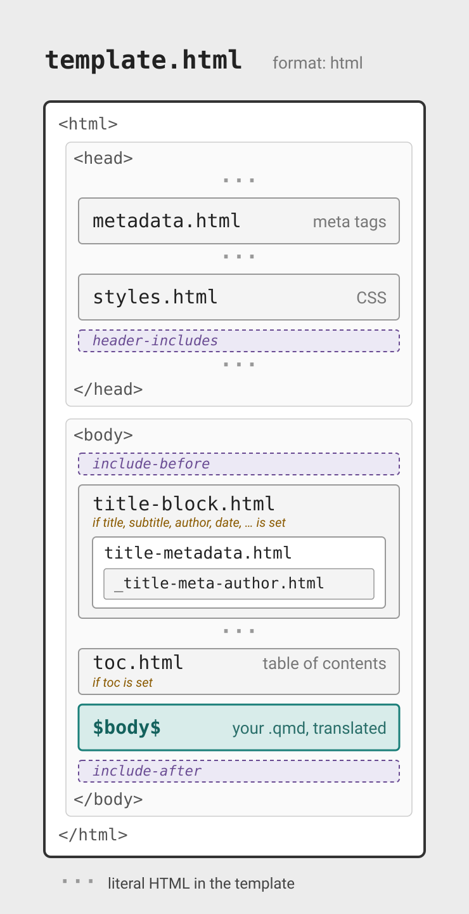

# Templates and template partials

## Templates

- Quarto uses Pandoc templates to generate the rendered output from a markdown file. 

- A **Pandoc template** is a mix of format specific content and variables, where the variables are replaced with their values from a rendered document

## Diagram of content -> template

## Example: Basic LaTeX template

::: {.columns}

::: {.column .fragment width="25%"}

**Input:**

``` {.markdown filename="article.qmd"}
Hello **world**!
```

:::

::: {.column .fragment width="35%"}

**Template:**

``` {.latex filename="my-awesome-template.tex"}
\documentclass{scrartcl}
\begin{document}
$body$
\end{document}
```

:::

::: {.column .fragment width="40%"}

**Output:**

``` {.latex filename="article.tex"}
\documentclass{scrartcl}
\begin{document}
Hello \textbf{world}!
\end{document}
```

`$body$` replaced with LaTeX generated from body of document

:::
:::

## Diagram of template (i.e. what are partials)

## Full or partial?

- Replacing an entire template offers full control of output but comes with the risk of omitting required variables that can break Pandoc/Quarto features.

- Safer approaches:

  - Selectively **replace** partials that exist within the master LaTeX or HTML template

  - Replace the entire LaTeX or HTML template, but then **include** partials provided with Quarto to ensure that your template takes advantage of all Pandoc and Quarto features

## Replace partials to...

* Zhuzh up your `title-slide` 💅 in `format: revealjs`
* Expose custom metadata fields in `title-block` for `format: html`
* Create a custom layout for `format: typst`

# Working with partials

## Replacing partials

Do usage here.

- Quarto provides built in templates that are composed of a set of partial template files for LaTeX / PDF and HTML output

- You can *replace* portions of Quarto’s built in template which allows you to customize just a portion of the template without needing to replace it entirely

## What's in a name? 🌹

The name of the partial file must match the name of the partial in the built in template that you want to replace.

::: {.columns}

::: {.column .fragment width="43%"}

```{ .yaml filename="my-document.qmd"}
format:
  revealjs:
    template-partials:
      - better-title-slide.html
```

:::
::: {.column .fragment width="57%"}

``` {.bash}
ERROR: The format 'revealjs' only supports 
the following partials:
metadata.html
title-block.html
toc.html
styles.html
toc-slide.html
title-slide.html

Please provide one or more of these 
partials.
```

:::

:::

::: {.callout-caution .fragment}
In `format: html` you get no error and the partial is not applied.
:::

::: {.callout-tip .fragment}
Provide an empty file as a partial to opt out of some features without modifying the whole main template.
:::

## Example: Basic usage 

Complete working example with minimal content. Maybe a Your Turn instead.

## Partials for various formats {.smaller}

They exist! <https://quarto.org/docs/journals/templates.html>
Their content is written in the target format syntax

::: {.panel-tabset}

### LaTeX

```
document-metadata.latex
passoptions.latex
doc-class.tex
fonts.latex
font-settings.latex
common.latex
pandoc.tex
  tables.tex
  graphics.tex
  citations.tex
  babel-lang.tex
  tightlist.tex
  biblio-config.tex
after-header-includes.latex
hypersetup.latex
before-title.tex
title.tex
before-body.tex
toc.tex
before-bib.tex
biblio.tex
after-body.tex
```

### Typst

```
numbering.typ 
definitions.typ
typst-template.typ
page.typ
typst-show.typ
notes.typ
biblio.typ
```

### HTML

```
metadata.html
title-block.html
  title-metadata.html 
    _title-meta-author.html
toc.html
```

### Revealjs

```
toc-slide.html
title-slide.html
```

### Beamer

```
passoptions.latex
doc-class.tex
fonts.latex
font-settings.latex
common.latex
pandoc.tex
  tables.tex
  graphics.tex
  citations.tex
  babel-lang.tex
  tightlist.tex
  biblio-config.tex
after-header-includes.latex
hypersetup.latex
before-title.tex
title.tex
before-body.tex
toc.tex
before-bib.tex
biblio.tex
after-body.tex
```

:::

# Case study 

To cover:

* Finding the default partials on GitHub
* Referring to metadata, including nested metadata
* Using custom metadata
* Conditionals
* Loops
* Normalization (?)
* Style (?) for HTML this is outside of partials. 

## One name, five files: `title-block.html` {.smaller}

Quarto picks the partial for you, based on your YAML:

| Your YAML | Partial that renders |
|-----------|----------------------|
| *(nothing — Bootstrap default)* | [`templates/title-block.html`](https://github.com/quarto-dev/quarto-cli/blob/main/src/resources/formats/html/templates/title-block.html) ← **we started here** |
| `title-block-banner: true` (or a color/image) | [`templates/banner/title-block.html`](https://github.com/quarto-dev/quarto-cli/blob/main/src/resources/formats/html/templates/banner/title-block.html) |
| `title-block-style: manuscript` | [`templates/manuscript/title-block.html`](https://github.com/quarto-dev/quarto-cli/blob/main/src/resources/formats/html/templates/manuscript/title-block.html) |
| `title-block-style: none` | [`pandoc/title-block.html`](https://github.com/quarto-dev/quarto-cli/blob/main/src/resources/formats/html/pandoc/title-block.html) — Pandoc's plain title block |
| `template-partials: [title-block.html]` | **yours** — it replaces whichever of the above **would** have rendered |

Two helpers ride along with every `te
[`title-metadata.html`](https://github.com/quarto-dev/quarto-cli/blob/main/src/resources/formats/html/templates/title-metadata.html) (called by the title block) and
[`_title-meta-author.html`](https://github.com/quarto-dev/quarto-cli/blob/main/src/resources/formats/html/templates/_title-meta-author.html) — you can replace
those too.

## Wrapping Up

## Replacing the entire template

```{.markdown}
format:
  pdf:
    template: my-template.tex
```

## Use built-in partials

Use built in partials when composing your own template, which allows you to include specific features from Quarto and Pandoc without copying and maintaining the entire template code:

::: {.columns}
::: {.column width="35%"}

```{.latex filename="my-template.tex" code-line-numbers="|2|3-5"}
\documentclass{scrartcl}
$pandoc.tex()$  
\begin{document}
$body$          
\end{document}  
```

:::
::: {.column width="65%"}

- Use the `$pandoc.tex()$` partial to include pandoc configuration for text highlighting, tables, graphics, tight lists, citations, and header include.
- Add your custom template for `$body$`.

:::
::: 


## Other

Localization
Normalization
Bundling as an extension

# Questions?

# Template diagrams

## Template: `format: html` {.scrollable}

{fig-alt="A schematic of template.html as an ordered stack inside literal html, head, and body tags, each section drawn as a box. Inside the head: metadata.html (meta tags), styles.html (CSS), and a dashed header-includes slot. Inside the body: a dashed include-before slot; title-block.html (only if title, subtitle, author, date, or similar metadata is set), drawn as a container nesting title-metadata.html, which nests _title-meta-author.html; toc.html (table of contents, only if toc is set); the body; and a dashed include-after slot. Dotted marks between the boxes indicate the template's literal HTML boilerplate."}

## Template: `format: revealjs` {.scrollable}

{fig-alt="A schematic of template.html for revealjs as an ordered stack inside literal html, head, and body tags, each section drawn as a box. Inside the head: styles.html (shared with the html format) and a dashed header-includes slot. Inside the body: a dashed include-before slot, then a box marking the div with class slides, holding title-slide.html, toc-slide.html (only if toc is set), and the body (one section element per slide), then the template's literal reveal.js setup scripts shown as a dotted mark, and last a dashed include-after slot. Dotted marks between the boxes indicate the template's literal HTML boilerplate."}

## Template: `format: pdf` {.scrollable}

{fig-alt="A schematic of template.tex as an ordered stack of partial files. The preamble partials come first: document-metadata.latex, passoptions.latex, doc-class.tex, fonts.latex, and font-settings.latex, then common.latex drawn as a container nesting pandoc.tex, which holds six leaf partials (babel-lang, biblio-config, citations, graphics, tables, tightlist) and the dashed header-includes slot, then after-header-includes.latex, hypersetup.latex, before-title.tex (empty hook), and title.tex. The document section, delimited by the literal begin-document and end-document lines, holds before-body.tex, a dashed include-before slot, toc.tex, the body, before-bib.tex (empty hook), biblio.tex, a dashed include-after slot, and after-body.tex (empty hook)."}
